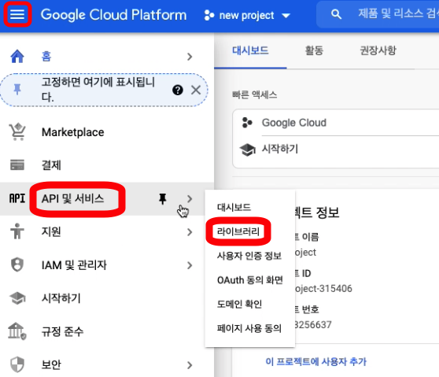
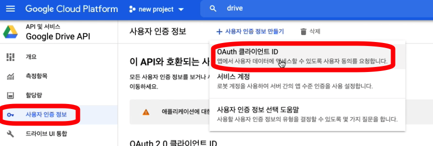
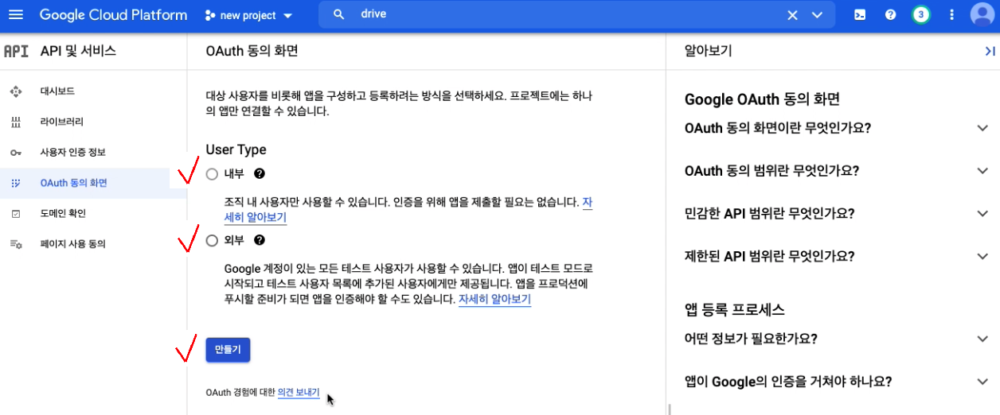

# android-string-table

## 💡소개
***
>구글 스프레드 시트에 작성한 내용을 안드로이드 스튜디오에서 사용 가능한 문자열 리소스 파일(.xml)로 변환한다.

## 💡Package별 기능 상세
***
### com.rsupport.download
>구글 시트를 엑설 파일(.xlsx)로 다운로드 한다.

### com.rsupport.google
>구글 api 관련 패키지

### com.ruspport.stringtable
>다운로드 한 엑셀 파일을 이용하여 문자열 리소스 파일을 생성한다.

### com.rsupport.plugin
>플러그인 관련 패키지

## 💡플러그인 적용 방법
***
### Build.gradle(:project)
````groovy
buildscript {  
      repositories {  
            google()  
            jcenter()  
            maven { url 'https://jitpack.io' }  
        }  
        dependencies {  
            classpath 'com.android.tools.build:gradle:4.1.3'  
            classpath "org.jetbrains.kotlin:kotlin-gradle-plugin:1.4.31"  
            classpath 'com.github.ssk0dev:android-string-table:recent_version'
      }  
    }
````
### Build.gradle(:app)
````groovy
apply plugin: 'android-string-table'
    
androidStringTable {  
  googleDriveCredentialPath '구글 credential 파일의 경로'
  outputXlsxFilePath '스프레드 시트가 다운로드 될 경로와 파일의 이름 지정 (파일 확장자는 .xlsx로 고정)'
  androidResourcePath '안드로이드 리소스 폴더 경로'  
  indexRowNumber 인덱스 행 번호
  targetSheetUrl '변환할 스프레드 시트의 url'  
  outputXmlFileName '생성될 xml 파일의 이름 지정'  
}
````

## 💡Credential 파일 다운로드 방법
***
**1. 구글 클라우드 콘솔(https://console.cloud.google.com/) 접속 후 로그인**

**2. 프로젝트 생성 혹은 프로젝트 선택**

**3. "API 및 서비스" 메뉴에서 "라이브러리" 선택**
   

**4. Google Sheet API, Google Drive API 검색하여 사용 설정**
   
   

**5. "사용자 인증 정보"에서 "사용자 인증 정보 만들기" 클릭 후 "OAuth 클라이언트 ID" 선택**
   

**6. "동의화면 구성" 버튼 클릭**
   

**7. 프로젝트의 목적에 맞게 동의화면 구성**
   

**8. "OAuth 클라이언트 ID" 생성 다시 시작**
   

**9. 어플리케이션 유형을 "데스크톱 앱"으로 설정. 이름을 설정 후 "만들기" 버튼 클릭**
   

**10. OAuth 2.0 클라이언트 ID 목록에서 다운로드 버튼을 클릭하면 client_secret_XXX.json 파일이 다운로드 되는데, 이 json 파일이 credential 파일이다.**
    
    
## 💡플러그인 적용시 생성되는 task
***

- **downloadSheetAndGenerateXmls**
  
  스프레드 시트를 다운로드하고 문자열 리소스 파일(.xml)을 생성한다.
- **downloadSpreadsheet**

  스프레드 시트를 다운로드 한다.
- **generateStringsXmls**

  문자열 리소스 파일(.xml)을 생성한다.

## 💡플러그인 적용 가능한 스프레드 시트 작성 방법
***
➰예제 스프레드 시트 : https://docs.google.com/spreadsheets/d/1W6WG_b40FmvyVbstodPgwA6USc0PRANoemCMN66_peM/edit#gid=0


1. 인덱스 행을 표시하기 위해 "id" 혹은 "identification"을 포함한 문자열을 입력한.
2. values를 포함하지 않은 열은 파싱되지 않고 넘어간다.
3. "values-국가, 언어 코드"로 해당 열의 국가와 언어를 표기한다.
4. 국가와 언어 코드가 표기되지 않은 단순 "values" 열은 기본 문자열 파일로 변환된다.다

## 💡스프레드 시트 URL
***
>공유 기능으로 링크 복사를 하는 것이 아니고 주소창에 있는 주소를 직접 복사해서 붙여넣는다.